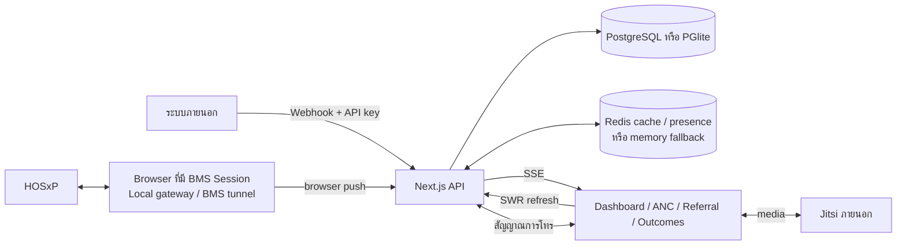

# KK-LRMS

ระบบสนับสนุนการเฝ้าระวังหญิงตั้งครรภ์ การคลอด การส่งต่อ และผลลัพธ์ทารกในระดับจังหวัดแบบ near-real-time

KK-LRMS เชื่อมข้อมูลจาก HOSxP ผ่าน browser-side gateway หรือ Webhook API แล้วจัดข้อมูลเป็นภาพรวมระดับจังหวัด ทะเบียนการตั้งครรภ์ งานห้องคลอด การส่งต่อ และผลลัพธ์ทารก ค่าเริ่มต้นของระบบมีเครือข่ายโรงพยาบาล 26 แห่งในจังหวัดขอนแก่น ผู้ดูแลสามารถเปลี่ยนจังหวัดหลักของ deployment และเพิ่มโรงพยาบาลจากทะเบียนที่ bundle มากับระบบได้

> [!IMPORTANT]
> ระบบนี้เป็นเครื่องมือสนับสนุนการติดตามและตัดสินใจของบุคลากร ไม่ใช่เครื่องมือวินิจฉัย ไม่สั่งการรักษาหรือส่งต่อโดยอัตโนมัติ และไม่แทนแนวทางเวชปฏิบัติหรือดุลยพินิจทางคลินิก

## ความสามารถที่ใช้งานอยู่

| พื้นที่งาน | ความสามารถหลัก |
| --- | --- |
| แดชบอร์ดจังหวัด | ภาพรวม ANC และผู้คลอด, ระดับความเสี่ยง, แนวโน้ม, การแจ้งเตือน, ความสดของข้อมูล, แผนที่และสถานะโรงพยาบาล รวมถึงโหมด kiosk |
| ทะเบียนการตั้งครรภ์ | ค้นหาและกรอง maternal journey ข้ามโรงพยาบาล, ระดับ `LOW`/`HR1`/`HR2`/`HR3`, WHO 8-contact schedule, ใกล้กำหนด, เลยกำหนด, ขาดนัด, จำนวน ANC ต่ำ และขาดการติดตาม |
| โรงพยาบาลและผู้คลอด | ภาระงาน ANC/ห้องคลอด, ผู้ตั้งครรภ์ใกล้คลอด, รายละเอียดผู้คลอด, vital signs, contractions, CPD score, partograph และประวัติการส่งต่อ |
| หอผู้ป่วยสูติกรรม | ward/room/bed occupancy, ย้ายเตียงแบบ drag-and-drop, partograph, vital signs, nurse notes, ยา, ระยะคลอด, ภาวะแทรกซ้อน, ทารก และ discharge โดยเชื่อม HOSxP |
| การส่งต่อ | ติดตาม `INITIATED → ACCEPTED → IN_TRANSIT → ARRIVED` หรือ `REJECTED`, ระดับความเร่งด่วน, SLA aging, เส้นทางส่งต่อ และแนวโน้ม 7 วัน |
| ผลลัพธ์ทารก | จำนวนคลอด, น้ำหนักแรกเกิดต่ำ, Apgar 5 นาที, การกู้ชีพ, ครรภ์แฝด, น้ำหนักเฉลี่ย, แนวโน้ม และรายละเอียดแยกโรงพยาบาล |
| วิดีโอปรึกษา | เรียกผู้ใช้ออนไลน์หรือโรงพยาบาลเข้ากลุ่มสูงสุด 8 คนผ่าน Jitsi; สื่อเสียง/ภาพไม่วิ่งผ่านเซิร์ฟเวอร์ KK-LRMS |
| ผู้ดูแลระบบ | จังหวัดหลัก, โรงพยาบาล, BMS Tunnel, consult doctors, Webhook keys, ภาพรวม sync, ผู้ใช้ออนไลน์, reconciliation API และเครื่องมือ simulation สำหรับ development |

### เส้นทางข้อมูลการตั้งครรภ์

ระบบเชื่อมข้อมูลเป็น `maternal journey` ระดับการตั้งครรภ์ ตั้งแต่ ANC ไปยังการเข้าห้องคลอด การส่งต่อ การคลอด และระยะหลังคลอด โดยใช้ CID hash สำหรับการจับคู่ข้ามโรงพยาบาล ส่วน `cached patient` แทน episode การเข้ารับบริการห้องคลอดแต่ละครั้ง ดูโครงสร้างตารางเพิ่มเติมที่ [src/db/tables/README.md](src/db/tables/README.md)

ค่าที่ขาดหรือยังไม่ทราบจะถูกแสดงเป็น unknown/missing และไม่ถูกตีความเป็นสถานะปกติสีเขียวโดยอัตโนมัติ ตัวชี้วัด ANC ในระบบนับจากทะเบียนที่ผ่าน ingest และ gate ของ deployment ปัจจุบัน จึงไม่ใช่ตัวหารประชากรหญิงตั้งครรภ์ทั้งจังหวัดและไม่ควรใช้กล่าวอ้าง coverage ระดับประชากรโดยไม่มีการตรวจสอบแหล่งข้อมูลเพิ่มเติม

### CPD risk score

CPD score เป็น decision support จาก 8 ปัจจัย:

| ปัจจัย | กติกาคะแนนปัจจุบัน |
| --- | --- |
| Gravida | ครรภ์แรก = 2 |
| จำนวน ANC | น้อยกว่า 4 ครั้ง = 1.5 |
| อายุครรภ์ | ตั้งแต่ 40 สัปดาห์ = 1.5 |
| ส่วนสูง | ต่ำกว่า 150 ซม. = 2; 150 ถึงน้อยกว่า 155 ซม. = 1 |
| น้ำหนักที่เพิ่ม | มากกว่า 20 กก. = 2; มากกว่า 15 ถึง 20 กก. = 1 |
| Fundal height | มากกว่า 36 ซม. = 2; มากกว่า 34 ถึง 36 ซม. = 1 |
| U/S estimated fetal weight | มากกว่า 3,500 กรัม = 2; มากกว่า 3,000 ถึง 3,500 กรัม = 1 |
| Hematocrit | ต่ำกว่า 30% = 1.5 |

ระดับคะแนนคือ `LOW` 0–4.99, `MEDIUM` 5–9.99 และ `HIGH` ตั้งแต่ 10 ขึ้นไป ปัจจัยที่ไม่มีข้อมูลจะถูกระบุใน `missingFactors` และให้ 0 คะแนน ดังนั้นข้อมูลไม่ครบอาจทำให้คะแนนต่ำกว่าความเสี่ยงจริง บุคลากรต้องอ่านคะแนนร่วมกับข้อมูลทางคลินิกทั้งหมด

Partograph แสดงกราฟความก้าวหน้าการคลอด, alert/action lines และกฎ CDSS สำหรับข้อมูลมารดา ทารก การหดรัดตัว และความก้าวหน้าการคลอด ผลลัพธ์ทั้งหมดเป็นคำเตือนสนับสนุนการประเมิน ไม่ใช่คำวินิจฉัย

### Maternal screening

Maternal screening ยังอยู่ในสถานะ `PROVISIONAL_UNAPPROVED`:

- UI แบบ read-only และ shadow label เปิดโดยค่าเริ่มต้น
- การ ingest assessment และการกระจาย state-change event ปิดโดยค่าเริ่มต้น
- shadow mode ไม่มีผลต่อ workflow การแจ้งเตือนหรือการรักษา
- ต้องมี clinical sign-off ก่อนเปิดใช้กฎให้มีผลต่อ workflow

ดูสถานะการอนุมัติที่ [docs/clinical/maternal-screen-phase0-signoff.md](docs/clinical/maternal-screen-phase0-signoff.md) และ mapping ข้อมูล HOSxP ที่ [docs/hosxp/maternal-screening-field-map.md](docs/hosxp/maternal-screening-field-map.md)

## สถาปัตยกรรมและการไหลของข้อมูล



### การ sync ที่ใช้อยู่จริง

- ไม่มี scheduled polling จาก HOSxP ฝั่ง server
- browser tab ที่ authenticated ด้วย BMS Session แบบ read/write, มี marketplace token และสังกัดโรงพยาบาลที่ active จะดึง HOSxP ครั้งแรกทันที แล้วทำซ้ำทุก 60 วินาทีโดยค่าเริ่มต้น
- browser อ่านผ่าน local gateway ที่ `127.0.0.1:45011` หรือ BMS tunnel fallback แล้วส่งชุดข้อมูลไป `/api/sync/browser-push`
- ProviderID เป็น read-only และไม่ทำ browser push
- ระบบภายนอกส่งข้อมูลได้ที่ `POST /api/webhooks/patient-data` ด้วย Bearer API key; รองรับ labor, `anc_data`, `referral`, `referral_update` และ `partograph` ตามสัญญา Webhook
- SSE แจ้ง client เมื่อข้อมูลเปลี่ยน ส่วนแต่ละหน้ามีรอบ SWR refresh ของตนเอง จึงไม่ควรตีความว่าทุกหน้าสดในรอบเวลาเดียวกัน

หากไม่มี browser tab ที่ผ่านเงื่อนไขและไม่มี Webhook sender ระบบจะไม่มีแหล่งดึง HOSxP ตามเวลาเอง ข้อมูลผลลัพธ์และ KPI ต่าง ๆ สะท้อนเฉพาะรายการที่ sync เข้ามาแล้ว

## การเข้าสู่ระบบและสิทธิ์

| ช่องทาง | ขอบเขต |
| --- | --- |
| BMS Session | read/write สำหรับโรงพยาบาลที่ลงทะเบียนและ active; ใช้ browser sync และงานหอผู้ป่วยได้เมื่อ session มีสิทธิ์ที่ต้องใช้ |
| ProviderID | read-only สำหรับข้อมูลทางคลินิกของหน่วยงานที่อนุญาต; route guard ปิดการแก้ไขข้อมูลในกลุ่ม admin, onboarding, sync, referral และเส้นทางทางคลินิกที่กำหนด |
| Development bypass | `DEV_AUTH_BYPASS=true` ใช้ได้เฉพาะ non-production และยกบทบาทเป็น `ADMIN`; ไม่มีผลใน production |

บทบาทในระบบคือ `ADMIN`, `OBSTETRICIAN` และ `NURSE` การซ่อนเมนูเป็นเพียง UI; API และ route ตรวจสิทธิ์ซ้ำฝั่ง server

ใน production การเข้า `/admin` ต้องผ่านครบทั้งสามเงื่อนไข:

1. role เป็น `ADMIN`
2. session ไม่ใช่ read-only
3. CID อยู่ใน `ADMIN_ALLOWED_CIDS`

`ADMIN_ALLOWED_CIDS` ทำงานสองทิศทาง: นอกจากเป็นเงื่อนไขจำกัด (ข้อ 3) แล้ว ยังเป็นการ**มอบสิทธิ์**ด้วย — ผู้ใช้ที่ login ผ่าน BMS (readwrite) และ CID อยู่ในรายการ จะถูกยกบทบาทเป็น `ADMIN` ตอน sign-in แม้ตำแหน่งใน HOSxP จะไม่ใช่ "ผู้อำนวยการ" (session แบบ ProviderID/read-only ไม่ถูกยกบทบาทเด็ดขาด)

`ADMIN_ALLOWED_CIDS` ที่ว่างใน production หมายถึงไม่มีผู้ใช้ใดเข้า admin ได้ (fail closed) และไม่มีการยกบทบาทใด ๆ

## เริ่มพัฒนาในเครื่องด้วย PGlite

### สิ่งที่ต้องมี

- Node.js 20
- npm และ Git
- OpenSSL สำหรับสร้าง secret

ติดตั้ง dependency แบบ reproducible:

```bash
npm ci
test -e .env.local || cp .env.example .env.local
```

คำสั่งนี้ไม่เขียนทับ `.env.local` เดิม หากไฟล์มีอยู่แล้วให้เทียบกับ `.env.example` และรวมเฉพาะตัวแปรใหม่ด้วยตนเอง

สร้าง secret สองค่าด้วยคำสั่งแยกกัน:

```bash
openssl rand -base64 32
openssl rand -hex 32
```

นำผลลัพธ์ไปใส่ `.env.local` อย่าใส่ข้อความ `$(openssl ...)` แบบ literal เพราะไฟล์ env ไม่ประมวลผล shell:

```env
USE_PGLITE=true
NEXTAUTH_URL=http://localhost:3000
NEXTAUTH_SECRET=<ผลจาก openssl rand -base64 32>
ENCRYPTION_KEY=<ผลจาก openssl rand -hex 32>
DEV_AUTH_BYPASS=true
DEV_SIMULATION_ENABLED=false
```

เริ่มเซิร์ฟเวอร์:

```bash
npm run dev
```

เปิด [http://localhost:3000](http://localhost:3000) หรือใช้ auto-login สำหรับ development ที่ `http://localhost:3000/?bms-session-id=dev-local`

PGlite เก็บข้อมูลถาวรที่ `./.pglite-data` โดยค่าเริ่มต้นและมีลำดับความสำคัญเหนือ `DATABASE_URL` เมื่อ `USE_PGLITE=true` การเริ่มแบบนี้ไม่ทำให้มีข้อมูล HOSxP จริงโดยอัตโนมัติ; ต้องใช้ BMS Session/Webhook หรือข้อมูล simulation ใน development

> [!CAUTION]
> `/api/dev/simulate/*` สามารถล้างตารางข้อมูลทางคลินิกได้ ฟีเจอร์นี้เปิดโดยค่าเริ่มต้นนอก production เว้นแต่ตั้ง `DEV_SIMULATION_ENABLED=false` และถูกปิดแบบ fail-closed ใน production เสมอ

## ติดตั้งด้วย Docker Compose

สิ่งที่ต้องมีคือ Docker Engine, Docker Compose v2, Git และ Node.js/npm สำหรับเรียก `npm run deploy`

Compose ปัจจุบันมี service `postgres`, `redis` และ `app` ไม่มี service ชื่อ `db` และเปิด host port เฉพาะแอป:

- Compose default: host `3003` → container `3000`
- `.env.production.example` กำหนด `APP_PORT=3000`
- PostgreSQL และ Redis ใช้เฉพาะเครือข่ายภายใน Compose และไม่มี host port mapping

เตรียม deployment:

```bash
test -e .env || cp .env.production.example .env
```

คำสั่งนี้ไม่เขียนทับ `.env` เดิม หากมีไฟล์อยู่แล้วให้เทียบกับ `.env.production.example` ก่อน deploy

แก้ `.env` อย่างน้อย:

- `POSTGRES_PASSWORD` เป็นรหัสผ่านที่แข็งแรง
- `NEXTAUTH_SECRET` เป็นค่าสุ่ม
- `ENCRYPTION_KEY` เป็น hexadecimal 64 ตัวอักษร
- `NEXTAUTH_URL` เป็น public URL จริงของระบบ
- `ADMIN_ALLOWED_CIDS` เป็น CID ผู้ดูแลที่อนุญาต
- ค่า BMS/ProviderID ตามช่องทางเข้าสู่ระบบที่ใช้งาน

ตรวจ config และ deploy:

```bash
docker compose config -q
npm run deploy
docker compose ps
docker compose logs app --since 5m
```

`npm run deploy` บันทึก Git SHA/เวลา build แล้วรัน `docker compose up -d --build` แบบ detached ให้รอจน `docker compose ps` แสดง service `app` เป็น `healthy` (healthcheck มี start period 90 วินาที) แล้วจึงตรวจ readiness ด้วยพอร์ต host ที่ตั้งจริง เช่น:

```bash
curl -fsS http://127.0.0.1:3000/api/health/ready
```

เปลี่ยน `3000` เป็น `APP_PORT` ของ deployment หากใช้ค่าอื่น

### การเริ่มฐานข้อมูล

แอปทำงานต่อไปนี้อัตโนมัติเมื่อ initialization ครั้งแรก:

1. ตรวจ configuration ที่จำเป็น
2. เชื่อมต่อฐานข้อมูล
3. sync schema และรัน idempotent migrations
4. seed snapshot ภูมิศาสตร์ไทยและโรงพยาบาลเริ่มต้น 26 แห่งในขอนแก่น
5. เริ่มงาน retention ของ audit log

ไม่มีคำสั่ง migration หรือ seed ที่ผู้ติดตั้งต้องรันแยก

ข้อมูล Compose อยู่ใน bind mount `postgres-data/` และ `redis-data/` repository นี้ไม่มีระบบ backup/restore อัตโนมัติ ผู้ดูแลต้องกำหนด backup, restore drill, retention, encryption และสิทธิ์ filesystem เองก่อนใช้กับข้อมูลจริง

## Environment variables สำคัญ

| ตัวแปร | ใช้เมื่อ | ความหมาย |
| --- | --- | --- |
| `USE_PGLITE` | local/test | `true` เพื่อใช้ embedded PostgreSQL; dev data อยู่ที่ `.pglite-data` |
| `DATABASE_URL` | Node runtime | PostgreSQL connection string เมื่อไม่ใช้ PGlite; Compose สร้างค่านี้ให้ container |
| `POSTGRES_PASSWORD` | Compose | บังคับใช้สำหรับ PostgreSQL service |
| `REDIS_URL` | optional/local | ถ้าไม่ตั้ง ระบบใช้ in-process memory; ถ้าตั้งแล้ว Redis ล่ม ระบบลดระดับพร้อมสถานะ degraded |
| `NEXTAUTH_URL` | ทุก deployment | URL หลักของแอป |
| `NEXTAUTH_SECRET` | ทุก deployment | secret ของ session/auth |
| `ENCRYPTION_KEY` | ทุก deployment | AES key แบบ hexadecimal 64 ตัวอักษร |
| `BMS_VALIDATE_URL` | BMS auth | endpoint ตรวจ BMS Session |
| `ADMIN_ALLOWED_CIDS` | production admin | allow-list CID คั่นด้วย comma; CID ในรายการถูกยกเป็น ADMIN ตอน BMS login; ว่างแล้ว admin fail closed |
| `READONLY_LOGIN_HCODES` | ProviderID | หน่วยบริการที่อนุญาต read-only |
| `NEXT_PUBLIC_MOPH_OAUTH_CLIENT_ID` และ Provider API secrets | ProviderID | OAuth/client credentials สำหรับ ProviderID |
| `DEV_AUTH_BYPASS` | development เท่านั้น | เปิด offline/dev admin fallback; production เพิกเฉย |
| `DEV_SIMULATION_ENABLED` | development เท่านั้น | ปิดด้วย `false` หากไม่ต้องการ destructive simulation routes |

### Maternal screening flags

| ตัวแปร | ค่าเริ่มต้น | ผล |
| --- | --- | --- |
| `MATERNAL_SCREEN_UI_ENABLED` | `true` | แสดง UI ที่ติดป้าย provisional/shadow |
| `MATERNAL_SCREEN_SHADOW_MODE` | `true` | ประเมินแบบ dormant ไม่มี workflow effect |
| `MATERNAL_SCREEN_INGEST_ENABLED` | `false` | ไม่บันทึก screening assessment จาก ingest |
| `MATERNAL_SCREEN_EVENTS_ENABLED` | `false` | ไม่ส่ง screening state-change event |

Compose forward ตัวแปร maternal screening ทั้งสี่รายการ แต่ `AUDIT_LOG_RETENTION_DAYS` และ `CSRF_TRUSTED_ORIGINS` ในไฟล์ตัวอย่างยังไม่ถูก forward เข้า `app` container ใน Compose ปัจจุบัน การตั้งสองค่านี้ใน `.env` เพียงอย่างเดียวจึงไม่มีผลกับ container จนกว่าจะเพิ่ม mapping ใน `docker-compose.yml`

## Health และการปฏิบัติการ

| Endpoint | ความหมาย |
| --- | --- |
| `GET /api/health/ready` | ตอบ 200 เมื่อ initialization สำเร็จและฐานข้อมูลผ่าน `SELECT 1`; Docker ใช้เป็น healthcheck |
| `GET /api/health` | ภาพรวม liveness/dependency; ฐานข้อมูลล้มเหลวตอบ 503 แต่ Redis หรือโรงพยาบาล offline อาจตอบ 200 พร้อมสถานะ degraded |

ข้อกำหนด production ที่อยู่นอก Compose:

- วาง reverse proxy/TLS หน้าแอปและกำหนด public `NEXTAUTH_URL` ให้ตรง
- สำรองทั้ง PostgreSQL และ Redis data ตามนโยบายองค์กร
- เฝ้าระวัง readiness, degraded health, sync freshness และพื้นที่ดิสก์
- ทดสอบ restore และแผน downtime ก่อนใช้งานจริง
- ตรวจความพร้อมของบริการภายนอก BMS, ProviderID และ Jitsi แยกจาก health ของแอป

## การทดสอบ

```bash
npm run lint
npx tsc --noEmit --incremental false
npm test
npm run build
```

ไม่ระบุจำนวน test แบบตายตัว เพราะเปลี่ยนตาม codebase

Playwright ไม่เปิด web server ให้อัตโนมัติ ให้เปิดสอง terminal:

```bash
# terminal 1
npm run dev

# terminal 2
npm run test:e2e
```

ค่า base URL เริ่มต้นคือ `http://127.0.0.1:3000` และเปลี่ยนได้ด้วย `PLAYWRIGHT_BASE_URL`

Live BMS smoke เป็น opt-in และต้องมี session จริง:

```bash
LIVE_BMS_SESSION_ID=<session-id> npm test -- tests/smoke
```

## API หลัก

| กลุ่ม | ตัวอย่าง | การยืนยันตัวตน |
| --- | --- | --- |
| Health/public | `GET /api/health`, `GET /api/health/ready` | public |
| Webhook ingest | `POST /api/webhooks/patient-data` | Bearer API key ของโรงพยาบาล |
| Referral eligibility | `POST /api/referrals/check` | Bearer Webhook API key |
| Dashboard/clinical | `/api/dashboard/*`, `/api/journeys/*`, `/api/patients/*`, `/api/hospitals/*` | authenticated session |
| Maternity ward | เรียก HOSxP ผ่าน BMS browser client และบันทึก audit ที่กำหนด | BMS Session read/write |
| Referral lifecycle | `/api/referrals/*` | authenticated session และ mutation guard |
| Video call/presence | `/api/calls/*`, `/api/presence/*`, `/api/sse/calls` | authenticated session |
| Admin | `/api/admin/*` | production admin gate |
| SSE | `/api/sse/dashboard`, `/api/sse/calls` | authenticated session |

สัญญา request/response, mode `incremental`/`full_snapshot` และตัวอย่าง client อยู่ที่ [docs/WEBHOOK-SPEC.md](docs/WEBHOOK-SPEC.md)

## โครงสร้างโปรเจกต์

```text
src/
├── app/
│   ├── (auth)/                 # Login
│   ├── (provincial)/           # Dashboard, ANC, hospitals, referrals, outcomes, admin
│   ├── (hospital)/             # Maternity ward
│   ├── calls/                  # Jitsi call room
│   └── api/                    # Route handlers
├── components/                 # UI แยกตาม domain
├── services/                   # Clinical/domain logic, sync, audit, calls
├── db/                         # Adapters, schema, migrations, seeds, table definitions
├── hooks/                      # SWR, browser poll และ UI hooks
├── lib/                        # Auth, encryption, cache, feature flags, security
├── config/                     # Navigation, risk rules และ runtime config
└── types/                      # Domain/API/HOSxP types

tests/
├── unit/
├── integration/
├── e2e/
└── smoke/
```

Stack หลัก: Next.js 16.2, React 19.2, TypeScript 5, Tailwind CSS 4, NextAuth v5 beta, PostgreSQL 16, PGlite, Redis 7, SWR 2, Recharts 3, Vitest, Playwright และ Node.js 20

## มาตรการความปลอดภัยและความเป็นส่วนตัว

- เข้ารหัสชื่อและ CID ใน relational records ที่กำหนดด้วย AES-256-GCM
- ใช้ SHA-256 CID hash สำหรับเชื่อม journey ข้ามโรงพยาบาล และเก็บ Webhook API key เป็น hash
- ปกปิดชื่อบางส่วนในหน้ารายการ แต่ผู้มีสิทธิ์ยังเห็นรายละเอียดที่จำเป็นในหน้าผู้ป่วย/หอผู้ป่วย
- บันทึก audit สำหรับกิจกรรมที่กำหนด; dashboard ความถี่สูงใช้ sampling และ audit เป็น best-effort จึงไม่ใช่หลักฐานว่าทุกการอ่านข้อมูลถูกบันทึก
- มี role/access guard, mutation guard, CSRF origin checks, HSTS ใน production, CSP, `X-Content-Type-Options`, Referrer Policy และ Permissions Policy
- ไม่มี `X-Frame-Options` โดยตั้งใจ และ CSP อนุญาต `frame-ancestors *` เพื่อรองรับการฝังใน BMS

Redis cache บางรายการอาจมี display data ที่ถอดรหัสแล้ว และ Compose เปิด Redis AOF ลง `redis-data/` ดังนั้นไม่ควรอ้างว่าข้อมูลผู้ป่วยทั้งหมดถูกเข้ารหัส at rest ผู้ดูแลต้องคุ้มครอง PostgreSQL, Redis, backup, log และ filesystem โดยรวม รวมถึงทำ DPIA/PDPA assessment และกำหนด retention ตามนโยบายองค์กร ระบบไม่ได้ประกาศการรับรอง PDPA โดยอัตโนมัติจากมาตรการในโค้ดเพียงอย่างเดียว

## ข้อจำกัดปัจจุบัน

- ระบบเป็น near-real-time ที่ขึ้นกับ browser poll หรือ Webhook ไม่ใช่ hard real-time และไม่มี server-side HOSxP polling
- ไม่มี service worker, offline queue หรือ PWA; payload ล่าสุดอาจยังแสดงเมื่อการเชื่อมต่อสะดุด แต่ mutation และ sync ต้องใช้เครือข่าย
- ข้อมูลโรงพยาบาล/ภูมิศาสตร์เป็น snapshot ที่ bundle มากับ source ไม่ใช่ live MOPH API
- KPI ANC และ outcomes ครอบคลุมเฉพาะข้อมูลที่ ingest สำเร็จ ไม่ใช่การรับรอง coverage ทั้งจังหวัด
- Maternal screening ยัง provisional และไม่มี workflow effect ตามค่าเริ่มต้น
- การย้ายเตียงและ discharge เป็น composite operation กับ HOSxP; ความล้มเหลวระหว่างขั้นตอนอาจทำให้สำเร็จเพียงบางส่วน จึงต้องตรวจผลและ audit หลังดำเนินการ
- หน้า referral ระดับจังหวัดเน้นการติดตาม; backend รองรับ lifecycle แต่ UI อาจไม่มี action สำหรับทุก transition
- reconciliation report มี admin API แต่ยังไม่มีหน้าจอเฉพาะ
- ความพร้อมใช้งานของ BMS, ProviderID และ Jitsi อยู่นอกขอบเขต uptime ของ KK-LRMS
- repository ไม่มี backup/restore automation, TLS termination หรือ public license file

## เอกสารอ้างอิงใน repository

| เอกสาร | เนื้อหา |
| --- | --- |
| [docs/WEBHOOK-SPEC.md](docs/WEBHOOK-SPEC.md) | Webhook API และตัวอย่าง integration |
| [docs/BMS-SESSION-FOR-DEV.md](docs/BMS-SESSION-FOR-DEV.md) | การใช้ BMS Session ระหว่างพัฒนา |
| [src/db/tables/README.md](src/db/tables/README.md) | data model และขอบเขตตาราง |
| [docs/who-guideline-2026-07-14.md](docs/who-guideline-2026-07-14.md) | ขอบเขต/ช่องว่างระหว่างระบบกับแนวทาง ANC |
| [docs/clinical/maternal-screen-phase0-signoff.md](docs/clinical/maternal-screen-phase0-signoff.md) | gate และสถานะ clinical sign-off |
| [docs/hosxp/maternal-screening-field-map.md](docs/hosxp/maternal-screening-field-map.md) | mapping maternal screening จาก HOSxP |

เอกสาร plan/spec เก่าอาจสะท้อนพฤติกรรมในช่วงเวลาที่เขียน เมื่อข้อความขัดกันให้ยึด route, service, configuration และ test ปัจจุบันเป็นหลัก

## สิทธิ์การใช้งาน

`package.json` กำหนดโครงการเป็น private และ repository ไม่มีไฟล์ public license ห้ามสรุปสิทธิ์การนำไปใช้ แก้ไข หรือแจกจ่ายจาก README นี้ ให้ยึดข้อตกลงกับเจ้าของระบบ
